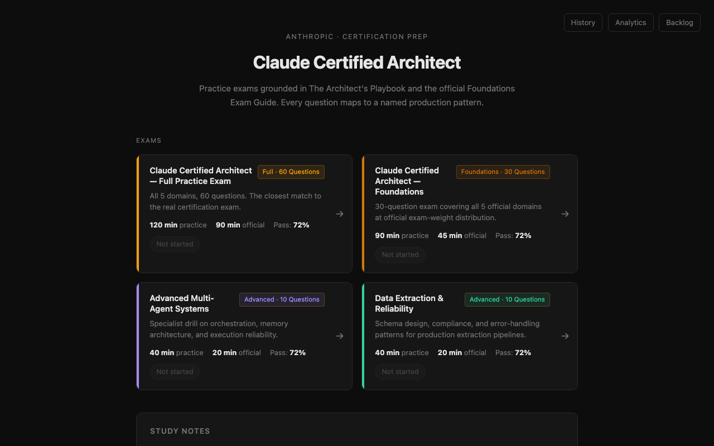
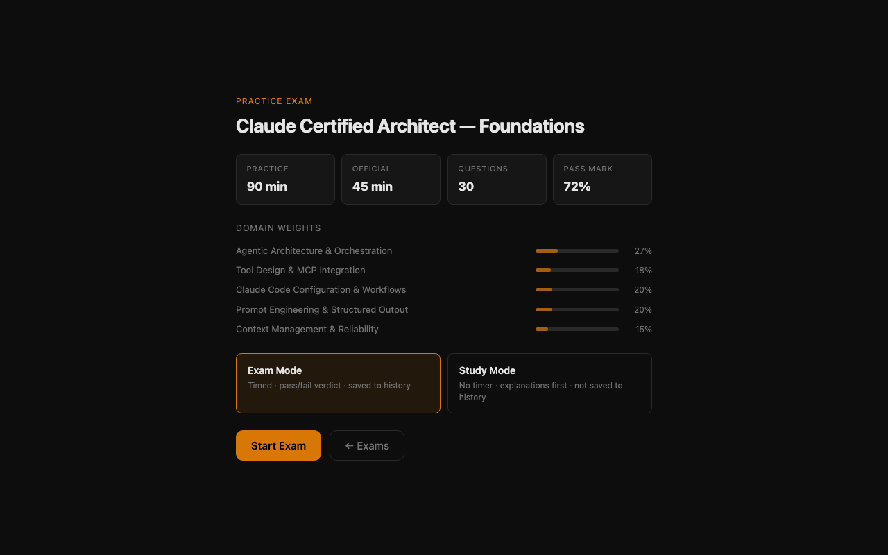
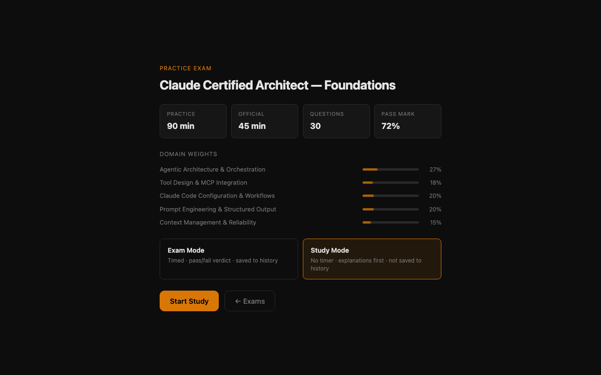
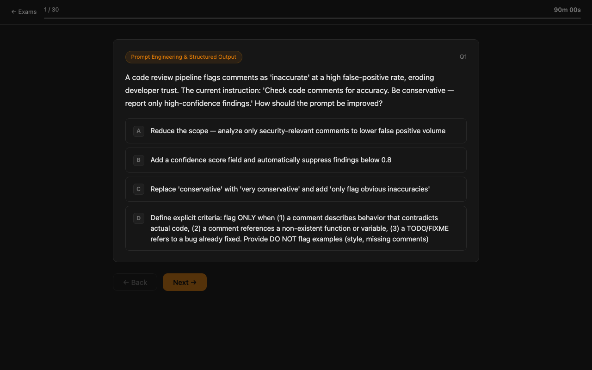
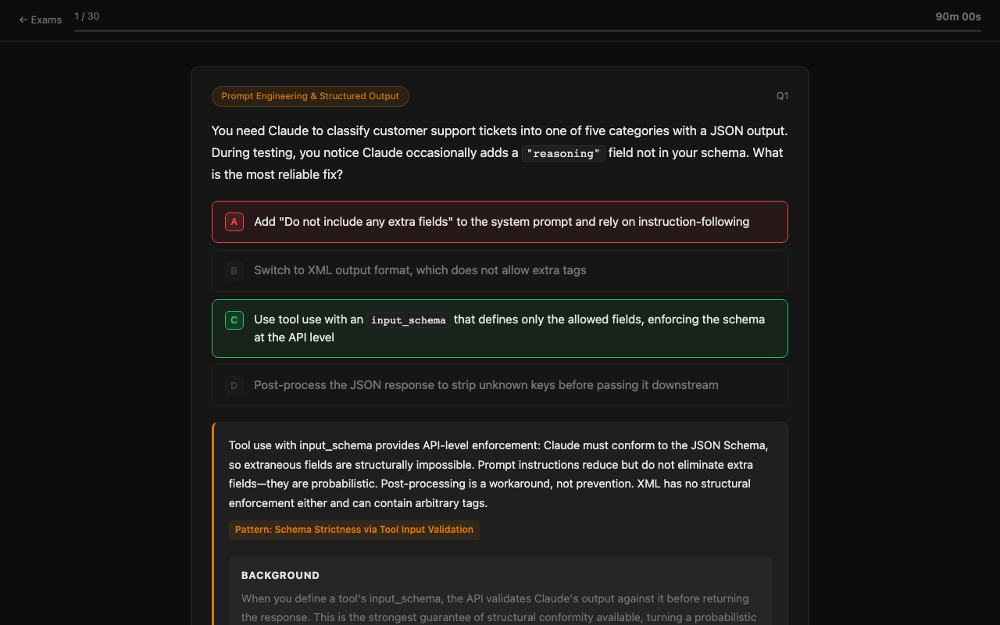
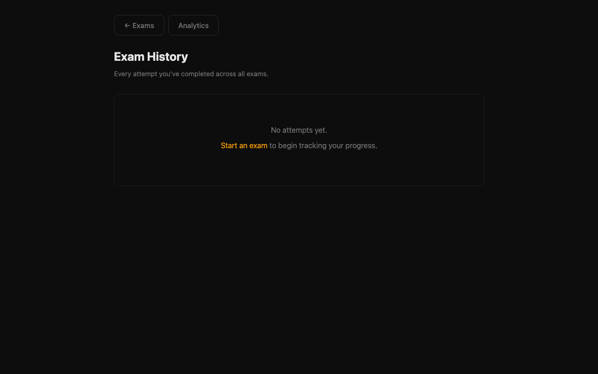
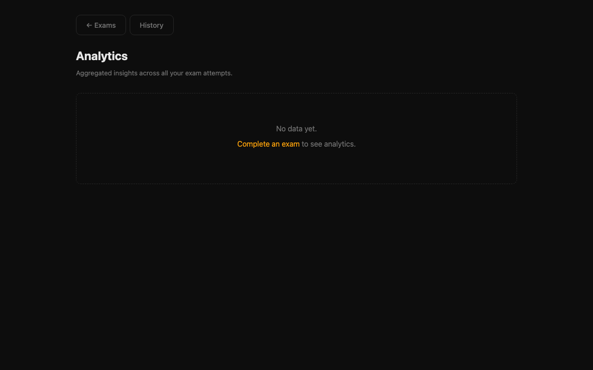

# Claude Certified Architect — Practice Exams

Self-contained React SPA for the **Claude Certified Architect — Foundations** certification. Four exams, 272 unique questions across all 5 official domains. Questions are stored in JSON banks, randomly sampled by domain weight, and shuffled on every load — so each attempt presents a fresh order.

---

## Exams

| Route | Questions drawn | Bank size | Time (practice / official) | Domains |
|---|---|---|---|---|
| `/exam/full` | 60 | 89 | 120 min / 90 min | All 5 |
| `/exam/foundations` | 30 | 143 | 90 min / 45 min | All 5 |
| `/exam/agents` | 10 | 20 | 40 min / 20 min | D1 + D5 |
| `/exam/extraction` | 10 | 20 | 40 min / 20 min | D2 + D4 + D5 |

Start with **Full** for the closest match to the real exam, then use the focused exams to drill weak domains.

---

## Features

- **Exam Mode** — timed, pass/fail verdict (72% threshold), domain breakdown, saved to history
- **Study Mode** — no timer, amber "Study" badge, no pass/fail verdict, not saved to history
- **Weak-area drill** — after any exam, a "Drill Weak Areas" button appears when any domain scored < 75%; launches a targeted 10-question mini-exam drawn exclusively from those domains
- **Best score badges** — each exam card on the home page shows your best score and attempt count
- **History** (`/history`) — full attempt log with filter tabs, aggregate stats, domain bar charts
- **Analytics** (`/analytics`) — domain performance across all attempts, hardest/easiest questions, SVG score-trend sparklines per exam
- **Keyboard navigation** — `1`–`4` select options, `Enter`/`Space` advances, `←`/`Backspace` goes back
- **Auto-save progress** — resume a mid-exam session from where you left off
- **Backlog** (`/backlog.html`) — visual project backlog board (auto-generated from `worklog.txt`)

---

## Screenshots



*Home — exam cards with score history badges*



*Start screen — Exam Mode / Study Mode toggle with domain weights*



*Start screen — Study Mode selected*



*Question screen — domain pill, options, progress bar, timer*



*Question screen — answer selected with explanation and Background panel*



*History — attempt log with stats bar (empty state)*



*Analytics — domain performance, score trends (empty state)*

---

## Prerequisites

### To run the app

- **Node.js v22.1.0+** — [nodejs.org](https://nodejs.org). Check: `node --version`.

### To use the content generation tools (`/fetch`, `/search`, `/generate`)

The generation pipeline calls the **Claude Code CLI** (`claude`) directly.

**Install Claude Code:**
```bash
npm install -g @anthropic-ai/claude-code
```

**Authenticate** (opens a browser login flow):
```bash
claude
```

Follow the prompts to sign in with your Anthropic account. Once authenticated, no API key or `.env` file is needed.

**Verify it works:**
```bash
claude --version
claude --print "say hello"
```

---

## Installation

```bash
git clone <repo-url>
cd claude-exam-guide
npm install
```

`npm install` is always required — it installs React, React Router, and Vite.

---

## Running

### Development (hot reload)

```bash
npm run dev
```

Opens at **http://localhost:5173** (Vite default). Changes to `src/` update instantly.

### Production preview

```bash
npm run build       # compiles to dist/
npm start           # serves dist/ at http://localhost:3069
```

To use a different port:

```bash
npm run start:8090            # http://localhost:8090
node scripts/serve.js dist 9000  # any port
```

Or with `npx serve`:

```bash
npm run serve       # http://localhost:3069
```

> The built `dist/` output is a standard static site. Any static file server works.

### Refresh screenshots

```bash
npm run screenshot
```

Builds the app, starts a local server, captures all routes with Playwright/Chromium, and injects the `## Screenshots` section into this README automatically.

---

## Usage

1. Install and start the server (see above).
2. Open the URL — the home page lists all four exam cards with your best score history.
3. Click an exam card.
4. On the **Start screen**, choose **Exam Mode** (timed, saved) or **Study Mode** (untimed, not saved), then click Start.
5. Answer questions. Keyboard shortcuts: `1–4` to select, `Enter`/`Space` to advance, `←`/`Backspace` to go back.
6. After answering each question, the **explanation** and **Background** panel appear immediately — read them before advancing.
7. On the **Results screen**:
   - Exam Mode: score, pass/fail verdict, domain breakdown, time vs. official limit, Save Results (JSON)
   - Study Mode: score, "Learning Summary" heading, domain breakdown
   - If any domain scored < 75%, a **"Drill Weak Areas"** button launches a 10-question follow-up targeting those domains
8. Visit **History** or **Analytics** in the nav to review past performance.

Progress is saved automatically in `localStorage`. Close the tab at any time and resume where you left off (Exam Mode only).

---

## Project Structure

```
claude-exam-guide/
├── src/
│   ├── main.jsx              # React entry point
│   ├── App.jsx               # Router: / · /exam/:id · /history · /analytics
│   ├── index.css             # Global design system (dark theme, CSS variables)
│   ├── data/
│   │   └── exams.json        # Single source of truth for all exam configs
│   ├── lib/
│   │   ├── buildExam.js      # buildExam() + buildDrillExam() — domain-weighted sampling
│   │   ├── loadQuestions.js  # Lazy-loads question bank JSON files
│   │   ├── storage.js        # localStorage helpers: saveResult / loadHistory / saveProgress
│   │   └── format.js         # Shared formatting utilities
│   └── pages/
│       ├── Home.jsx          # Exam selector with score badges
│       ├── Exam.jsx          # Full exam flow: start → questions → results
│       ├── History.jsx       # Attempt log with filter tabs and stats bar
│       └── Analytics.jsx     # Domain performance, question difficulty, score trends
│
├── public/
│   ├── backlog.html          # Visual project backlog (auto-generated from worklog.txt)
│   ├── DISCLAIMER.md         # Non-affiliation notice
│   └── LICENSE.md            # MIT-0 license
│
├── questions/                # Question bank JSON files (edit here to add questions)
│   ├── foundations.json      # 143 questions, all 5 domains (draws 30)
│   ├── full.json             # 89 questions, all 5 domains (draws 60)
│   ├── agents.json           # 20 questions, D1 + D5 (draws 10)
│   └── extraction.json       # 20 questions, D2 + D4 + D5 (draws 10)
│
├── materials/                # Fetched/searched source documents (git-ignored)
│
├── scripts/
│   ├── serve.js              # Zero-dependency static file server (serves dist/)
│   └── tools/
│       ├── fetch_materials.js        # Download a URL or local file into materials/
│       ├── search_for_materials.js   # Search the web for new exam content (claude CLI)
│       ├── generate_questions.js     # Generate new questions from materials (claude CLI)
│       ├── hooks/
│       │   ├── archive-webfetch.js   # PostToolUse: auto-archive WebFetch pages
│       │   ├── validate-questions.js # PostToolUse: validate questions/*.json on Write
│       │   └── render-backlog.js     # PostToolUse: regenerate backlog.html on worklog Write
│       └── lib/
│           ├── claude.js     # Wrapper around the local claude CLI
│           ├── materials.js  # Read/write materials store
│           ├── logger.js     # File + stderr logger for hook scripts
│           └── env.js        # .env loader
│
├── archived/                 # Original standalone HTML exams (pre-React migration)
├── dist/                     # Vite production build output (git-ignored)
│
├── .claude/
│   ├── settings.json         # Hook configuration (PostToolUse)
│   └── commands/             # Slash commands: /fetch  /search  /generate
│
├── vite.config.js            # Vite + React plugin config
├── worklog.txt               # Task backlog and project history
├── CLAUDE.md                 # Project instructions for Claude Code sessions
└── package.json              # npm scripts + dependencies
```

---

## Question Generation Pipeline

Three CLI tools expand the question banks. They work as a pipeline: `fetch_materials` and `search_for_materials` populate the `materials/` store, then `generate_questions` reads from it.

All three call the **local `claude` CLI** — no SDK, no `ANTHROPIC_API_KEY` needed.

### Two ways to invoke

**From Claude Code (recommended)** — slash commands in `.claude/commands/`:

```
/fetch <url-or-path> [--name "label"]
/search [--topic agentic|tools|claudecode|prompting|context] [--query "..."]
/generate --bank <foundations|agents|extraction|full> --count <n>
```

**From the terminal:**

```bash
npm run fetch  -- <url-or-path>
npm run search -- --topic agentic
npm run generate -- --bank foundations --count 5
```

---

### 1. `fetch_materials` — store a document

```bash
npm run fetch -- <url-or-path> [--name <label>]
```

Examples:

```bash
npm run fetch -- https://docs.anthropic.com/en/docs/agents-and-tools
npm run fetch -- ~/Downloads/Anthropic_Exam_Guide.pdf --name "Official Exam Guide"
npm run fetch -- ~/Downloads/"The Architect's Playbook.pdf" --name "Architect Playbook"
npm run fetch -- ./my-study-notes.md
```

---

### 2. `search_for_materials` — discover new content

```bash
npm run search -- [--topic <topic>] [--query "custom string"] [--limit <n>] [--dry-run]
```

Topics: `agentic` · `tools` · `claudecode` · `prompting` · `context`

```bash
npm run search                              # all 5 domains (~10 queries)
npm run search -- --topic agentic
npm run search -- --query "Claude MCP server tool design best practices 2025"
npm run search -- --topic context --dry-run # preview without saving
```

Search results are cached — re-running the same query is a no-op unless you pass `--force`.

---

### 3. `generate_questions` — generate and append questions

```bash
npm run generate -- --bank <name> [--count <n>] [--material <path>] [--no-verify] [--dry-run]
```

```bash
npm run generate -- --bank foundations --count 5
npm run generate -- --bank full --count 10
npm run generate -- --bank agents --count 3 --material materials/2025-01-01_agents-guide.json
npm run generate -- --bank foundations --count 5 --dry-run
npm run generate -- --bank full --count 5 --no-verify
```

---

### Full workflow example

```bash
npm run fetch -- https://docs.anthropic.com/en/docs/agents-and-tools
npm run fetch -- ~/Downloads/Anthropic_Exam_Guide.pdf --name "Official Exam Guide"
npm run search -- --topic agentic
npm run generate -- --bank foundations --count 15
npm run dev     # verify questions appear
```

---

## Hooks

Three `PostToolUse` hooks run automatically during any Claude Code session.

### `archive-webfetch`
Fires after every `WebFetch` call. Saves the page to `materials/` if it has > 500 chars and hasn't been stored before.

### `validate-questions`
Fires after every `Write` to `questions/*.json`. Validates required fields, unique IDs, 4-option arrays, and valid answer indices.

```
[validate-questions] ✓ foundations.json: 143 questions, all valid
[validate-questions] ✗ full.json: 1 issue — Q91: missing field "background"
```

### `render-backlog`
Fires after every `Write` to `worklog.txt`. Regenerates `public/backlog.html` automatically.

---

## Adding or Editing Questions

Open the relevant `questions/<bank>.json` and add a question following this schema:

```json
{
  "id": 59,
  "domain": "Agentic Architecture & Orchestration",
  "text": "Question stem. HTML is allowed — use <code>...</code> for inline code.",
  "options": [
    "First option text",
    "Second option text",
    "Third option text",
    "Fourth option text"
  ],
  "answer": 0,
  "pattern": "Pattern Name — Anti-pattern or technique label",
  "explanation": "Why the correct answer wins and why each distractor fails.",
  "background": "2–3 sentences on the underlying concept.",
  "refs": [
    { "label": "Link label", "url": "https://docs.anthropic.com/..." }
  ]
}
```

`answer` is the zero-based index into `options`. Options are shuffled on each load; the index is remapped automatically.

---

## Extending the Exam

### Adjusting how many questions are drawn per session

Open `src/data/exams.json` and edit the `selection` object for the relevant exam:

```json
"selection": {
  "Agentic Architecture & Orchestration":   8,
  "Tool Design & MCP Integration":          5,
  "Claude Code Configuration & Workflows":  6,
  "Prompt Engineering & Structured Output": 6,
  "Context Management & Reliability":       5
}
```

The bank must contain at least that many questions per domain. The larger the bank vs. the draw count, the more session variety.

### Creating a new exam

**Step 1 — Seed a bank file:**
```bash
echo "[]" > questions/security.json
npm run generate -- --bank security --count 20
```
> Add `security` to the `BANKS` object in `scripts/tools/generate_questions.js` first.

**Step 2 — Add the exam config to `src/data/exams.json`:**

```json
{
  "id": "security",
  "title": "Claude Certified Architect — Security & Trust",
  "description": "...",
  "badge": "Security · 10 Questions",
  "questionFile": "security",
  "timeLimitMin": 40,
  "officialTimeLimitMin": 20,
  "warnSecs": 300,
  "passMark": 72,
  "accent": "#f87171",
  "accentDim": "rgba(248,113,113,.11)",
  "domains": [
    { "name": "Trust & Safety", "weight": 40 },
    { "name": "Access Control", "weight": 60 }
  ],
  "selection": {
    "Trust & Safety":  4,
    "Access Control":  6
  }
}
```

The new exam card appears on the home page automatically — no HTML edits needed.

---

## Domain Coverage

| Bank | D1 drawn | D2 drawn | D3 drawn | D4 drawn | D5 drawn | Bank size |
|---|:---:|:---:|:---:|:---:|:---:|:---:|
| `foundations.json` | 8 | 5 | 6 | 6 | 5 | 143 |
| `full.json` | 16 | 11 | 12 | 12 | 9 | 89 |
| `agents.json` | — | — | — | — | — | 20 |
| `extraction.json` | — | — | — | — | — | 20 |

**Domain keys:**
- D1 — Agentic Architecture & Orchestration (27%)
- D2 — Tool Design & MCP Integration (18%)
- D3 — Claude Code Configuration & Workflows (20%)
- D4 — Prompt Engineering & Structured Output (20%)
- D5 — Context Management & Reliability (15%)

---

## Caveats

**`npm run dev` or a built `dist/` must be served — do not open files directly.**
The app is a React SPA. Opening `dist/index.html` from the filesystem (`file://`) breaks client-side routing and asset loading. Always use `npm run dev` or `npm start` (which serves `dist/`).

**Progress and history are per-browser and per-origin.**
`localStorage` is scoped to the origin (`http://localhost:5173` in dev, `http://localhost:3069` in prod). Switching ports or browsers starts a fresh session. Exported JSON results are the only portable record.

**Study mode and drill mode attempts are not saved to history.**
Only completed Exam Mode runs appear in History and Analytics. This is intentional — study sessions are for learning, not measurement.

**`generate_questions` appends — it does not deduplicate IDs across runs.**
If you delete questions manually from a JSON bank, re-running generation assigns new IDs starting from `max(id) + 1`. Clean the bank first if you want a full re-generate.

**Generated questions are checked but not guaranteed.**
The verification pass asks Claude to flag factual errors, but LLMs can be confidently wrong. Always read generated questions before raising `selection` counts — treat the output as a draft.

**`search_for_materials` makes several `claude` CLI calls per run.**
Running without `--topic` executes ~10 queries in sequence. Results are cached — re-running is a no-op unless you pass `--force`.

---

## Credits & Acknowledgements

Some questions and study patterns were inspired by:

**[paullarionov/claude-certified-architect](https://github.com/paullarionov/claude-certified-architect)**
— a fantastic community reference for the Claude Certified Architect exam.

Additional source material drawn from:
- [Anthropic Documentation](https://docs.anthropic.com) — official API docs, tool use, agents, prompt engineering
- [Anthropic Blog](https://www.anthropic.com/news) — model releases and technical deep-dives
- The Architect's Playbook — 21 production patterns referenced throughout the question banks

> This project is a personal hobby project and is not affiliated with Anthropic. See [DISCLAIMER.md](DISCLAIMER.md) for the full non-affiliation notice.
